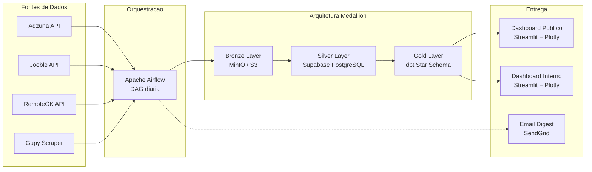

# DataTrack: Pipeline de Dados End-to-End para Inteligência de Vagas

[](https://www.python.org/)
[](https://airflow.apache.org/)
[](https://www.docker.com/)
[](https://www.postgresql.org/)
[](https://supabase.com/)
[](https://www.getdbt.com/)
[](https://streamlit.io/)
[](https://playwright.dev/)

## Sobre o Projeto

O **DataTrack** é um projeto de Engenharia de Dados de ponta a ponta que extrai, transforma e analisa vagas de trabalho do setor de dados em todo o Brasil e no exterior. O pipeline orquestra rotinas diárias de coleta automática a partir de **4 fontes** (APIs REST e web scraping de SPAs dinâmicos), processa os dados brutos através de uma **arquitetura Medallion** com camadas Bronze, Silver e Gold, e entrega visualizações interativas em dashboards Streamlit com alertas automáticos por e-mail.

O projeto foi construído para demonstrar domínio prático sobre o **ciclo completo de um pipeline de dados moderno** — da ingestão bruta à entrega analítica — aplicando boas práticas de mercado em modelagem dimensional, qualidade de dados, observabilidade e CI/CD.

---

## Arquitetura do Pipeline



> **Fluxo resumido:** 4 extratores coletam dados brutos diariamente &rarr; Airflow orquestra a pipeline completa &rarr; dados brutos em JSON s&atilde;o persistidos no MinIO (Bronze) &rarr; carregados, deduplicados e classificados no Supabase PostgreSQL (Silver) &rarr; modelados em Star Schema pelo dbt (Gold) &rarr; consumidos por dashboards interativos e alertas di&aacute;rios por e-mail.

Para uma explicação detalhada de cada camada, consulte a [documentação de arquitetura](docs/arquitetura.md).

---

## Destaques Técnicos

| Capacidade | Detalhe |
|------------|---------|
| **Extração Multimodal** | 4 fontes simultâneas: 3 APIs REST + 1 scraper de SPA com Playwright (headless Chromium) |
| **Deduplicação Fuzzy** | Matching inteligente via `rapidfuzz` para identificar vagas repostadas com variações de título |
| **Classificação em Duas Etapas** | Tech Check (filtra vagas fora de tecnologia) + Data Check (valida pertinência à área de dados) |
| **Inferência de Modalidade** | Parser NLP que analisa título, localização e descrição para classificar vagas como Remoto, Híbrido ou Presencial |
| **Modelagem Dimensional** | Star Schema completo com dbt: 8 modelos finais (1 fato + 5 dimensões + 2 agregações) |
| **Qualidade de Dados** | 68 testes dbt automatizados (unicidade, integridade referencial, accepted_values, not_null) |
| **Observabilidade** | Tabelas de auditoria: `pipeline_logs` (telemetria) + `unmapped_skills_logs` (governança de skills) |
| **CI/CD** | GitHub Actions: testes unitários (pytest) + validação dbt contra PostgreSQL efêmero no runner |
| **Dashboards Interativos** | 2 dashboards Streamlit com tema dark/light, filtros dinâmicos e drill-down em tabelas |
| **Alertas Automáticos** | E-mail digest diário via SendGrid com destaques das novas vagas e métricas do pipeline |

---

## Fontes de Dados

| Fonte | Método | Tipo | Detalhe Técnico |
|-------|--------|------|-----------------|
| **Adzuna** | REST API | Agregador global | Paginação automática com rate limiting defensivo |
| **Jooble** | REST API | Agregador global | Bypass de WAF com rotação de User-Agent |
| **RemoteOK** | REST API | Vagas remotas | Parsing de JSON com campos não padronizados |
| **Gupy** | Web Scraping (Playwright) | ATS brasileiro (SPA) | Renderização JavaScript headless + interceptação de scroll infinito |

---

## Estrutura do Projeto

```
DataTrack/
├── .github/workflows/
│   └── ci.yml                       # CI/CD com GitHub Actions
├── dags/
│   └── datatrack_daily_pipeline.py  # DAG principal do Airflow
├── plugins/
│   ├── adzuna_extractor.py          # Extrator API Adzuna
│   ├── gupy_extractor.py            # Scraper SPA Gupy (Playwright)
│   ├── jooble_extractor.py          # Extrator API Jooble
│   ├── remoteok_extractor.py        # Extrator API RemoteOK
│   ├── email_sender.py              # Digest diario (SendGrid)
│   └── silver/                      # Transformacao Silver Layer
│       ├── loader.py                # Carregador Bronze -> Silver
│       ├── deduplicator.py          # Deduplicacao fuzzy (rapidfuzz)
│       ├── normalizer.py            # Classificacao inteligente
│       └── db.py                    # Operacoes de banco (upsert)
├── dbt/
│   ├── models/
│   │   ├── staging/                 # Views padronizadas da Silver
│   │   ├── intermediate/            # Logicas de classificacao
│   │   └── marts/                   # Star Schema (fato + dimensoes)
│   ├── tests/                       # Testes de integridade dbt
│   └── dbt_project.yml
├── dashboard/                       # Dashboard Publico (Streamlit)
│   ├── app.py                       # Busca inteligente de vagas
│   ├── database.py                  # Queries SQL com cache
│   ├── theme.py                     # Tema dark/light dinamico
│   └── pages/
│       └── 2_visao_geral.py         # KPIs e graficos do mercado
├── dashboard_interno/               # Dashboard Operacional (Streamlit)
│   ├── app.py                       # Telemetria do pipeline
│   ├── database.py                  # Queries operacionais
│   ├── theme.py                     # Tema operacional
│   └── pages/
│       ├── 2_logs_execucao.py       # Historico e latencia
│       └── 3_skills_nao_mapeadas.py # Governanca de skills
├── tests/                           # Testes unitarios (pytest)
│   └── silver/
│       ├── test_deduplicator.py     # Testes de dedup e modalidade
│       └── test_normalizer.py       # Testes de classificacao
├── sql/
│   └── create_silver_schema.sql     # DDL das tabelas Silver
├── docs/                            # Documentacao tecnica por fase
├── .env.example                     # Template de variaveis de ambiente
├── conftest.py                      # Configuracao global do pytest
├── docker-compose.yml               # Infraestrutura completa
├── Dockerfile                       # Imagem Airflow customizada
├── Makefile                         # Atalhos de operacao
└── requirements.txt                 # Dependencias Python
```

---

## Progresso do Projeto

O desenvolvimento foi dividido em fases metodológicas para simular entregas ágeis do mundo real:

| Fase | Tema | Entregas Principais | Doc |
|------|------|---------------------|-----|
| **1** | Infraestrutura e Primeira Ingestão | Setup Docker, DAG Airflow, extrator Adzuna, Bronze Layer no MinIO | [fase1_resumo.md](docs/fase1_resumo.md) |
| **2** | Expansão da Bronze Layer | Scraper Gupy (Playwright), APIs Jooble e RemoteOK, execução paralela | [fase2_resumo.md](docs/fase2_resumo.md) |
| **3** | Transformação e Camada Silver | Limpeza, deduplicação fuzzy, classificação inteligente, Supabase Cloud | [fase3_resumo.md](docs/fase3_resumo.md) |
| **4** | Modelagem Analítica (Gold) | dbt Star Schema, 68 testes automatizados, observabilidade, CI/CD | [fase4_resumo.md](docs/fase4_resumo.md) |
| **5** | Entrega e Visualização | Dashboards Streamlit, e-mail digest, inferência de modalidade, higienização | [fase5_resumo.md](docs/fase5_resumo.md) |

---

## Como Executar Localmente

### Pré-requisitos
- Docker e Docker Compose instalados
- Python 3.10+ (para os dashboards e dbt)
- Chaves de API: Adzuna, Jooble (consulte `.env.example`)

### 1. Clone e configure

```bash
git clone https://github.com/thcosta-dados/DataTrack.git
cd DataTrack
cp .env.example .env
# Edite o .env com suas chaves de API e credenciais Supabase
```

### 2. Suba a infraestrutura (Airflow + MinIO)

```bash
docker-compose up -d --build
```

Acesse o Apache Airflow em `http://localhost:8080` (login padrão: `admin` / `admin`).

### 3. Execute os dashboards

```bash
# Dashboard Público (porta 8501)
streamlit run dashboard/app.py

# Dashboard Interno (porta 8502)
streamlit run dashboard_interno/app.py
```

### 4. Execute o dbt (Gold Layer)

```bash
python -m venv dbt-env
dbt-env\Scripts\activate          # Windows
pip install dbt-core dbt-postgres
dbt run --profiles-dir dbt --project-dir dbt
dbt test --profiles-dir dbt --project-dir dbt
```

### 5. Execute os testes unitários

```bash
pip install -r requirements.txt
python -m pytest tests/ -v
```

---

## Governança e Ciclo de Vida do Data Lake

### Particionamento (Bronze Layer)
Os dados brutos no MinIO/S3 são organizados por fonte e data de execução:

```
s3://datatrack-bronze/{fonte}/{ano}-{mes}-{dia}/raw_jobs.json
```

Isso permite leitura otimizada por partição e reprocessamento retroativo (backfill) caso a lógica do pipeline Silver seja alterada.

### Política de Retenção

| Camada | Armazenamento | Retenção | Política |
|--------|---------------|----------|----------|
| **Bronze** (Raw) | MinIO / S3 Standard | 90 dias | Transição para Glacier Deep Archive; exclusão após 365 dias |
| **Silver/Gold** (DB) | Supabase PostgreSQL | Indefinida | Histórico incremental consolidado para análises de tendências |

---

## Licença

Este projeto é disponibilizado para fins de estudo e portfólio profissional.
