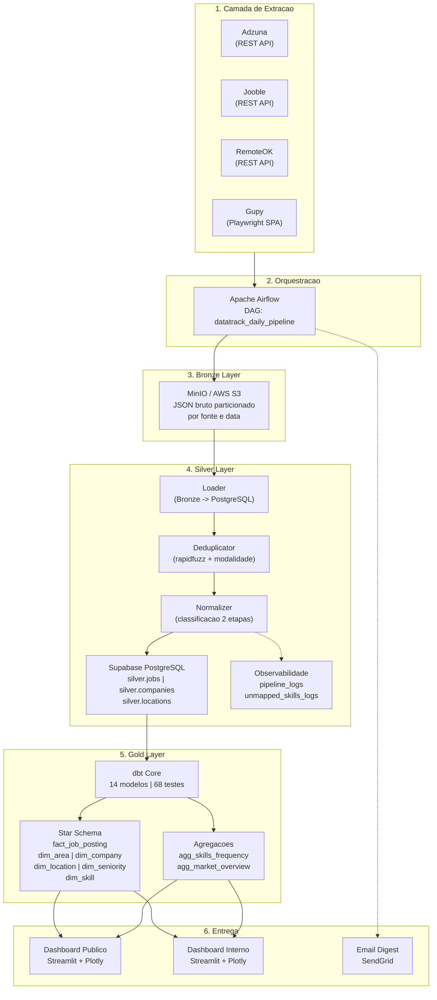

# DataTrack — Arquitetura do Pipeline de Dados

Este documento detalha a arquitetura técnica do projeto DataTrack, explicando cada camada do pipeline, as decisões de design e o fluxo de dados desde a extração até a entrega.

---

## Visão Geral

O DataTrack adota a **Arquitetura Medallion** (Bronze → Silver → Gold), orquestrada pelo Apache Airflow, para transformar dados brutos de múltiplas fontes em informação analítica limpa e acionável.



---

## Detalhamento por Camada

### 1. Camada de Extração

Quatro extratores independentes coletam dados brutos diariamente:

| Extrator | Arquivo | Método | Detalhes Técnicos |
|----------|---------|--------|-------------------|
| Adzuna | `plugins/adzuna_extractor.py` | REST API | Paginação automática com limite de taxa. Parâmetros de busca focados em vagas de dados no Brasil. |
| Jooble | `plugins/jooble_extractor.py` | REST API | Bypass de WAF via rotação de User-Agent. Tratamento defensivo de respostas inconsistentes. |
| RemoteOK | `plugins/remoteok_extractor.py` | REST API | Parsing de JSON com campos não padronizados. Foco em vagas remotas globais. |
| Gupy | `plugins/gupy_extractor.py` | Web Scraping | Playwright (headless Chromium) para renderizar SPA dinâmico. Interceptação de scroll infinito e extração de payloads JSON das requisições internas. |

Os extratores são executados em paralelo pela DAG do Airflow para maximizar o throughput e reduzir o tempo total da pipeline.

### 2. Orquestração (Apache Airflow)

A DAG `datatrack_daily_pipeline` (`dags/datatrack_daily_pipeline.py`) é o ponto central de orquestração. Ela coordena:

1. **Extração paralela** dos 4 extratores (tasks independentes)
2. **Carga na Silver Layer** (loader + deduplicator + normalizer)
3. **Transformação dbt** (Gold Layer)
4. **Envio do e-mail digest** (condicional ao sucesso do pipeline)

Toda execução é registrada automaticamente em `silver.pipeline_logs` com timestamps, contagens de volume e mensagens de erro para rastreabilidade completa.

### 3. Bronze Layer (MinIO / S3)

Os dados brutos são persistidos em JSON no MinIO (local) ou AWS S3 (produção), particionados fisicamente:

```
s3://datatrack-bronze/{fonte}/{ano}-{mes}-{dia}/raw_jobs.json
```

**Decisões de design:**
- Particionamento por fonte e data permite leitura seletiva e reprocessamento retroativo (backfill)
- Formato JSON bruto preserva fidelidade total dos dados de origem
- Política de retenção: 90 dias em Standard, transição para Glacier, exclusão após 365 dias

### 4. Silver Layer (Supabase PostgreSQL)

A camada Silver concentra a lógica de transformação em três módulos sequenciais:

**Loader** (`plugins/silver/loader.py`):
- Lê os JSONs da Bronze e normaliza os campos para um schema comum
- Insere registros brutos na tabela de staging

**Deduplicator** (`plugins/silver/deduplicator.py`):
- Matching fuzzy via `rapidfuzz` para identificar vagas repostadas com variações de título
- Inferência de modalidade de trabalho (Remoto, Híbrido, Presencial) analisando título, localização e descrição
- Garantia de exclusão mútua: se uma vaga é híbrida, `is_remote` é forçado para `False`

**Normalizer** (`plugins/silver/normalizer.py`):
- **Etapa 1 (Tech Check):** Filtra vagas fora de tecnologia usando dicionário de termos técnicos
- **Etapa 2 (Data Check):** Valida se a vaga de tecnologia pertence à área de dados
- **Classificação Final:** Categoriza em `data_engineering`, `data_science`, `data_analytics`, `bi` ou `ml_mlops`
- **Senioridade:** Regex com word boundaries (`\b`) para mapear `JR`, `PL`, `SR` e variantes com precisão

**Tabelas principais:**
- `silver.jobs` — Vagas únicas, classificadas e enriquecidas
- `silver.companies` — Empresas normalizadas
- `silver.locations` — Localizações padronizadas
- `silver.pipeline_logs` — Telemetria de cada execução
- `silver.unmapped_skills_logs` — Palavras-chave não mapeadas para governança

### 5. Gold Layer (dbt)

O dbt modela os dados da Silver em um **Star Schema** otimizado para consultas analíticas:

```
                    ┌─────────────┐
                    │  dim_area   │
                    └──────┬──────┘
                           │
┌──────────────┐    ┌──────┴───────┐    ┌────────────────┐
│ dim_company  ├────┤   fact_job   ├────┤  dim_seniority │
└──────────────┘    │   _posting   │    └────────────────┘
                    └──────┬───────┘
                           │
┌──────────────┐           │           ┌──────────────┐
│ dim_location ├───────────┘           │  dim_skill   │
└──────────────┘                       └──────────────┘
```

**Camadas intermediárias:**
- `int_jobs_classified` — Aplica o filtro `non_tech` / `non_data` para limpar a fato
- `int_jobs_with_skills` — Explode o array de skills em linhas para a dimensão de skills
- `int_company_size` — Calcula porte das empresas por volume de vagas

**Qualidade de dados:**
- 68 testes automatizados validam unicidade de chaves, integridade referencial, valores aceitos e não-nulidade em todas as tabelas finais

### 6. Camada de Entrega

**Dashboard Público** (`dashboard/`):
- Busca interativa de vagas com filtros dinâmicos (área, senioridade, localização, modalidade, skills, recência)
- Visão geral do mercado com KPIs e gráficos Plotly (distribuição por área, senioridade, modalidade)
- Drill-down para detalhes da vaga com link direto para candidatura
- Tema dark/light com toggle dinâmico

**Dashboard Interno** (`dashboard_interno/`):
- Telemetria do pipeline: status, volumes, taxa de deduplicação
- Histórico de execuções com gráfico de latência operacional
- Ranking de skills não mapeadas para calibração do dicionário

**E-mail Digest** (`plugins/email_sender.py`):
- Enviado automaticamente via SendGrid ao final de cada execução bem-sucedida
- Contém destaques das novas vagas e métricas consolidadas do dia
- Fallback local: salva HTML em `logs/last_email_digest.html` se a API key não estiver configurada

---

## Infraestrutura

O projeto utiliza Docker Compose para orquestrar localmente todos os serviços necessários:

| Serviço | Imagem | Porta | Função |
|---------|--------|-------|--------|
| Airflow Webserver | `apache/airflow:2.8.1` (custom) | 8080 | Interface de orquestração |
| Airflow Scheduler | `apache/airflow:2.8.1` (custom) | — | Execução das DAGs |
| PostgreSQL | `postgres:15` | 5432 | Metadados do Airflow |
| MinIO | `minio/minio` | 9000 / 9001 | Object Storage (Bronze Layer) |

A Silver/Gold Layer é hospedada no **Supabase Cloud** (PostgreSQL gerenciado), separando o armazenamento analítico da infraestrutura local de orquestração.

---

## CI/CD (GitHub Actions)

O workflow `.github/workflows/ci.yml` executa automaticamente em cada push/PR para `main`:

1. **Setup:** PostgreSQL efêmero no runner + Python 3.12
2. **Schema:** Executa `sql/create_silver_schema.sql` no banco de CI
3. **Testes Python:** `pytest tests/ -v` contra o PostgreSQL local
4. **Validação dbt:** `dbt run` + `dbt test` contra o mesmo banco

Isso garante que nenhuma mudança quebre a integridade do pipeline ou dos modelos analíticos antes de ser integrada.
